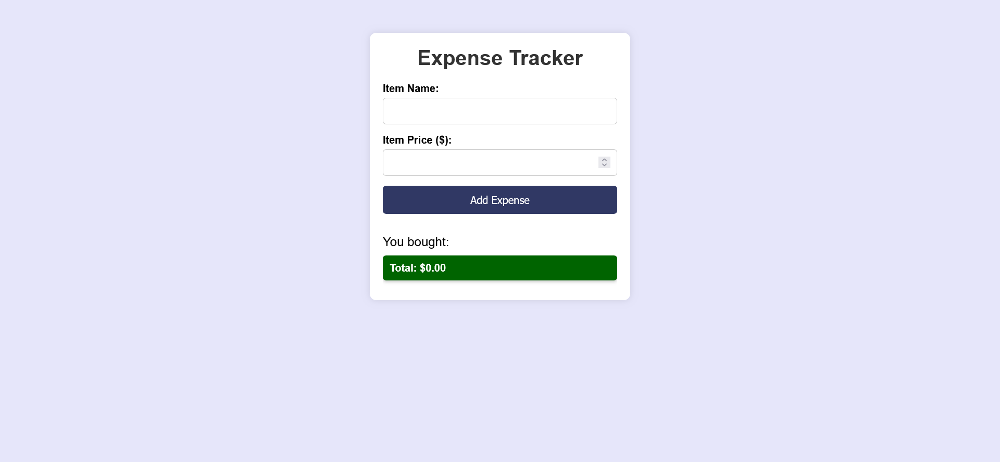

# Simple Expense Tracker Page /ICodeThis Challenge

This is a solution to a challenge "Simple Expense Tracker" from the website [ICodeThis](https://icodethis.com/modes/functional/37).

## Table of contents
- [Simple Expense Tracker Page /ICodeThis Challenge](#simple-expense-tracker-page-icodethis-challenge)
  - [Table of contents](#table-of-contents)
  - [Task](#task)
  - [Screenshot](#screenshot)
  - [Links](#links)
  - [How it works](#how-it-works)
  - [Built with](#built-with)
  - [Author](#author)

## Task

In this mode, you are given the HTML and CSS template and your focus should be on adding the required functionality with JS.
Note: You can't change the HTML and CSS (but you can use JS to alter the DOM if you need).
Implement the following functionalities:
When clicking on the Add Expense button, a new expense should be added to the #expense-list taking the name and the price of the item from the inputs.
Clear the #item-name and #item-price inputs when the expense is successfully added to the list.
Optional tasks: 
Delete existing expenses on page load. 
Show a total sum of all expenses.

## Screenshot

## Links

[Background Changer Page](https://your-solution-url.com)

## How it works

## Built with

- Semantic HTML5
- Modern CSS3 (Flexbox, Media Queries)
- Vanilla JS

## Author

- Website - [Andrei Martinenko](https://www.frontender.biz)
- Github - [@AxinitM](https://github.com/AxinitM)
- ICodeThis - [Axinit](https://icodethis.com/Axinit)
